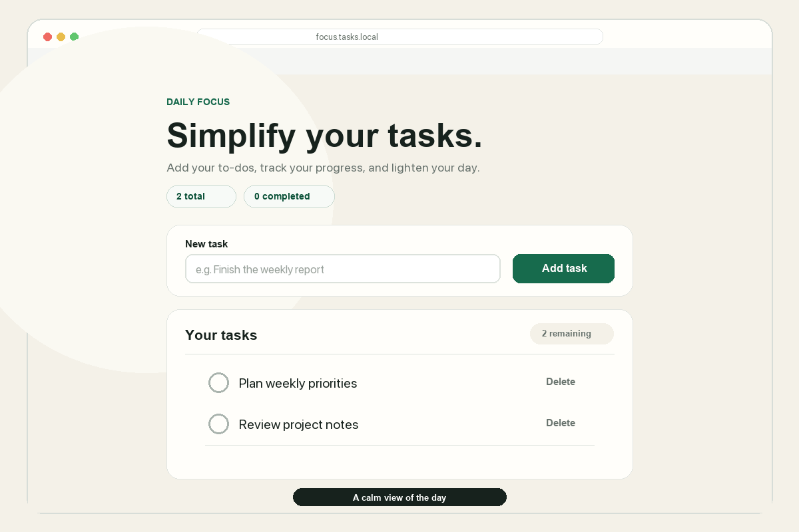

# Focus — Task Manager

[](https://github.com/fatmakahveci/react-ts-tasks/actions/workflows/ci.yml)
[](https://github.com/fatmakahveci/react-ts-tasks/releases)
[](https://nextjs.org/)
[](https://react.dev/)
[](https://www.typescriptlang.org/)
[](LICENSE.md)

Focus is a responsive task manager built with Next.js, React, and TypeScript. It keeps a concise daily task list in Firebase Realtime Database and provides clear feedback for every loading, validation, and network state.

## Demo



The walkthrough uses fictional sample data to demonstrate the core task flow without writing to a live Firebase database.

## Features

- Create tasks with whitespace normalization and a 160-character limit
- Mark tasks as complete or return them to the active list
- Delete tasks with per-item pending states that prevent duplicate requests
- Persist changes through the Firebase Realtime Database REST API
- Handle loading, empty, validation, timeout, request, and retry states
- Accept legacy Firebase records without a completion field
- Ignore malformed remote records instead of breaking the entire list
- Provide accessible labels, live status updates, focus indicators, and touch targets
- Adapt the interface for desktop and mobile screens

## Technology

- Next.js App Router
- React
- TypeScript in strict mode
- Firebase Realtime Database REST API
- CSS with responsive and reduced-motion styles
- Node.js built-in test runner
- ESLint with Next.js Core Web Vitals rules
- GitHub Actions continuous integration and Dependabot updates

## Getting Started

### Requirements

- Node.js 20.9 or newer
- npm
- A Firebase Realtime Database for persistent use

### Installation

```bash
git clone https://github.com/fatmakahveci/react-ts-tasks.git
cd react-ts-tasks
npm ci
cp .env.example .env.local
npm run dev
```

Open [http://localhost:3000](http://localhost:3000).

## Configuration

Set the complete Firebase collection URL in `.env.local`:

```dotenv
NEXT_PUBLIC_FIREBASE_TASKS_URL=https://your-project-default-rtdb.firebaseio.com/tasks.json
```

The value is required, must use the Firebase Realtime Database REST endpoint, and must end with `/tasks.json`. HTTPS is enforced except when connecting to a local Firebase emulator through `localhost` or `127.0.0.1`.

Because `NEXT_PUBLIC_*` values are included in browser code, this URL is not a secret. Authentication, authorization, and schema restrictions must be enforced with Firebase Security Rules. Never store service-account credentials or private tokens in this variable.

## Data Model

Firebase stores tasks below the `/tasks` collection. A record has the following shape:

```json
{
  "text": "Prepare release notes",
  "completed": false
}
```

Firebase generates the task identifier. The client uses that identifier for update and delete requests.

## Request Lifecycle

| Action | Method | Endpoint |
| --- | --- | --- |
| Load tasks | `GET` | `/tasks.json` |
| Create a task | `POST` | `/tasks.json` |
| Change completion state | `PATCH` | `/tasks/{id}.json` |
| Delete a task | `DELETE` | `/tasks/{id}.json` |

Requests time out after ten seconds. Responses pass through runtime validation before they enter application state.

## Available Commands

| Command | Purpose |
| --- | --- |
| `npm run dev` | Start the development server |
| `npm run build` | Create an optimized production build |
| `npm start` | Serve the production build |
| `npm run lint` | Run ESLint |
| `npm test` | Run data parsing and validation tests |
| `npm run check` | Run lint, tests, and the production build |

## Testing

The test suite covers:

- Task text trimming and validation
- Maximum-length enforcement
- Empty and malformed Firebase responses
- Backward compatibility with legacy task records
- Firebase-generated identifier validation

Run the complete quality gate before opening a pull request:

```bash
npm run check
```

## Project Structure

```text
src/
├── app/
│   ├── components/       Form, list, item, and reusable section UI
│   ├── lib/
│   │   ├── task-api.ts   Firebase requests and timeout handling
│   │   ├── task-data.ts  Normalization and runtime parsing
│   │   └── task-data.test.ts
│   ├── globals.css       Theme and responsive page layout
│   ├── layout.tsx        Root metadata and document layout
│   └── page.tsx          Application state and task orchestration
└── shared/
    └── types.ts          Shared task model
```

## Contributing and Security

Read the [contributing guide](.github/CONTRIBUTING.md) before submitting a pull request. Add or update tests for behavioral changes and run `npm run check` locally.

Report vulnerabilities privately according to the [security policy](.github/SECURITY.md). Do not include credentials, private Firebase data, or exploit details in public issues.

## Project Resources

- [Releases](https://github.com/fatmakahveci/react-ts-tasks/releases)
- [Changelog](CHANGELOG.md)
- [Contributing guide](.github/CONTRIBUTING.md)
- [Security policy](.github/SECURITY.md)
- [License](LICENSE.md)
